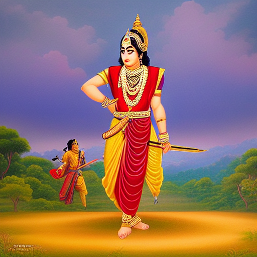
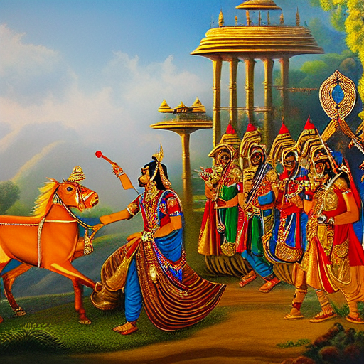
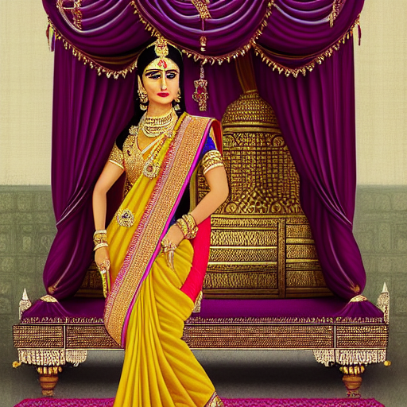

# The Next Ravi Varma

An AI image generation project inspired by the artistic style of **Raja Ravi Varma**.

The project explores how Stable Diffusion and LoRA fine-tuning can be used to generate new artwork influenced by Ravi Varma's visual style.

> **Note:** The generated images are AI-generated Ravi Varma-inspired artwork and are not authentic paintings by Raja Ravi Varma.

---

## Project Progress

### ✅ Milestone 1 — Dataset Preparation

- Collected 39 Ravi Varma paintings from Wikimedia Commons
- Validated the dataset
- Generated captions for the training images
- Prepared the dataset and training manifest
- Stored dataset metadata in `data/metadata/`
- Prepared training data in `data/processed/`

**Status: Completed**

---

### ✅ Milestone 2 — LoRA Fine-Tuning

- Configured Stable Diffusion 1.5 with LoRA
- Prepared the training pipeline
- Trained the LoRA model on Google Colab using a T4 GPU
- Successfully loaded the trained LoRA during generation
- Generated Ravi Varma-inspired images using the trained model

**Status: Completed**

---

### 🔄 Milestone 3 — Prompt Expansion & Scene Generation

The project currently supports text prompts for generating new scenes.

Planned improvements:
- Better prompt expansion
- More detailed scene control
- Improved generation quality

**Status: In Progress**

---

### ⏳ Milestone 4 — ControlNet & Evaluation

Planned:
- ControlNet pose conditioning
- CLIP-based evaluation
- Style similarity evaluation
- Gradio-based generation interface

**Status: Not Started**

---

## Current Results

Some of the images generated using the trained LoRA:

### Generated Examples

<p align="center">
  
  
</p>

<p align="center">
  
  
</p>

The current model is able to generate new scenes with visual characteristics influenced by the training dataset.

---

## Project Structure

```text
the-next-ravi-varma/
│
├── configs/          # Training and generation configurations
├── data/
│   ├── metadata/     # Dataset metadata
│   └── processed/    # Training manifest
├── notebooks/        # Project notebooks
├── scripts/          # Dataset, training and generation scripts
├── src/ravi_varma/   # Main project code
├── tests/             # Test suite
├── outputs/
│   └── generated/   # Generated images
│
├── app/              # Gradio application
├── README.md
└── LICENSE