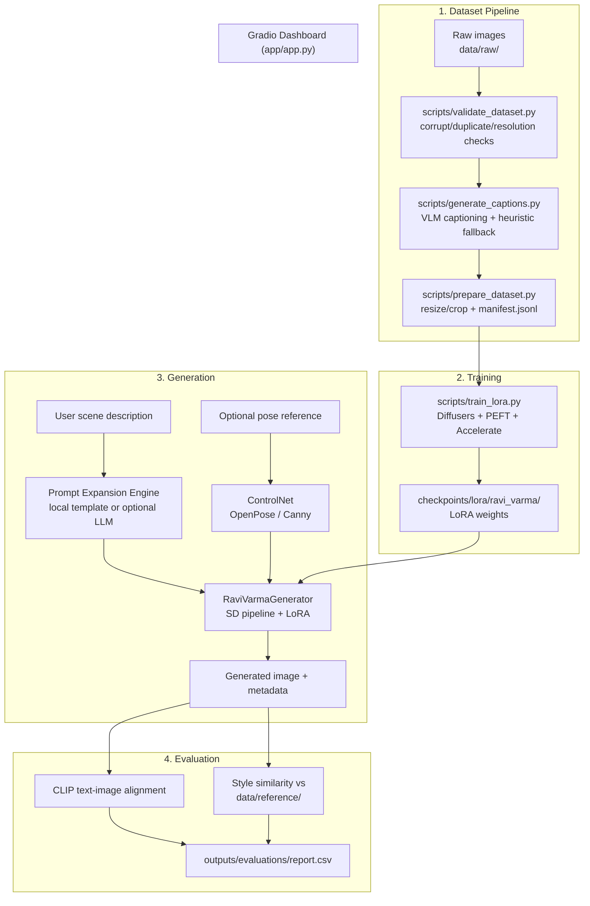

# The Next Ravi Varma

Generate novel, AI-created artwork in the style of **Raja Ravi Varma** (1848-1906), the
pioneering Indian painter who blended European academic realism with Indian mythological and
historical subject matter. Inspired by ["The Next Rembrandt"](https://www.nextrembrandt.com/)
(2016), this project fine-tunes a Stable Diffusion model with LoRA on Ravi Varma's visual
vocabulary and wraps it in prompt expansion, optional ControlNet pose conditioning, and a Gradio
dashboard.

> **This produces AI-generated, Ravi Varma-*inspired* artwork -- not authentic paintings by the
> artist.** See [Ethical & Copyright Considerations](#ethical--copyright-considerations) below.

## Architecture



## Project layout

```
the-next-ravi-varma/
├── configs/                # YAML configs (dataset, LoRA training x2, generation)
├── data/                   # raw/processed/captions/metadata/reference (see data/README.md)
├── checkpoints/lora/       # trained LoRA weights (see checkpoints/README.md)
├── src/ravi_varma/
│   ├── config.py           # typed pydantic config loaders
│   ├── data/               # validation.py, captions.py, dataset.py
│   ├── training/           # lora_trainer.py, callbacks.py
│   ├── generation/         # prompt_engine.py, controlnet.py, pipeline.py
│   ├── evaluation/         # clip_score.py, style_similarity.py, report.py
│   └── utils/              # device.py, image.py, logging.py
├── scripts/                # CLI entry points (see below)
├── app/                    # Gradio dashboard (app.py, components.py, styles.css)
├── notebooks/              # 01-05, incl. a Colab-ready LoRA training notebook
├── tests/                  # pytest suite
└── outputs/                # generated images + evaluation reports (gitignored)
```

## Hardware requirements

| Task | Minimum | Notes |
|---|---|---|
| Dataset validation / captioning (heuristic) / prompt expansion | Any CPU | No GPU or torch required at all |
| Captioning with a VLM (BLIP) | CPU (slow) or GPU | `transformers`+`torch` |
| LoRA training (SD1.5) | 8-12GB VRAM (T4 works) | Colab free tier is sufficient; `configs/lora_sd15.yaml` defaults are tuned for this |
| LoRA training (SDXL) | 16GB+ VRAM | Scaffolded in `configs/lora_sdxl.yaml`; see note in `lora_trainer.py` |
| Generation | 6-8GB VRAM, or CPU (slow, minutes/image) | `hardware.device: auto` picks the best available |

**Note on this repository's own dev/test environment:** the code was written and unit-tested in a
sandboxed container with no GPU and no network access to the Hugging Face Hub, and with too little
disk space to install `torch`. Every module is written so it *imports and degrades gracefully*
without the ML stack (dataset tools, prompt engine, config, evaluation-availability checks all
work standalone), and the training/generation code paths are verified with mocked
torch/diffusers objects in `tests/test_generation.py` -- but the actual diffusion training and
image generation have not been run end-to-end on real weights as part of building this repo. Run
`notebooks/03_lora_training.ipynb` on Colab (or any CUDA machine) for a real run.

## Setup

```bash
git clone <this-repo>
cd the-next-ravi-varma
python -m venv .venv && source .venv/bin/activate     # optional but recommended
make install            # pip install -r requirements.txt && pip install -e .
cp .env.example .env    # fill in only what you need (see comments in the file)
```

On Colab, use `make install-colab` (or `pip install -r requirements-colab.txt`) instead, which
skips reinstalling torch since Colab already ships a CUDA-linked build.

## Usage

```bash
# 1. Get images (public-domain Wikimedia Commons reproductions) or add your own to data/raw/
python scripts/download_dataset.py --limit 40

# 2. Validate
python scripts/validate_dataset.py

# 3. Caption (VLM by default; add --no-vlm for a zero-dependency offline fallback)
python scripts/generate_captions.py --write-metadata

# 4. Resize/crop + build the training manifest
python scripts/prepare_dataset.py

# 5. Train the LoRA (needs a GPU -- see notebooks/03_lora_training.ipynb for Colab)
python scripts/train_lora.py --config configs/lora_sd15.yaml

# 6. Generate
python scripts/generate.py --prompt "Arjuna standing before Krishna on the battlefield of Kurukshetra"

# 7. Evaluate
python scripts/evaluate.py --input outputs/generated --reference data/reference

# 8. Or just launch the dashboard, which wraps steps 6-7
python app/app.py
```

Run `pytest -v` to run the test suite (48 tests; runs fully without a GPU or the ML stack
installed, using mocked diffusion/torch objects for the generation-pipeline tests).

## Design choices worth knowing about

- **Every heavy ML import (torch/diffusers/transformers/peft/accelerate/open_clip) is lazy**,
  performed inside functions, not at module import time. This means `from ravi_varma.config import
  GenerationConfig` always works, even on a machine with none of those installed; only calling
  `.train()` or `.generate()` requires them, and does so with a clear error message (naming which
  packages are missing or broken) rather than a confusing stack trace.
- **No fabricated metrics.** If CLIP can't be loaded, or a reference corpus is empty,
  `evaluation/clip_score.py` and `evaluation/style_similarity.py` return `None`/zero references
  rather than a plausible-looking number.
- **No fabricated captions.** `HeuristicCaptioner` (the zero-dependency fallback used when no VLM
  is available) only reports properties it can measure from pixels (brightness, palette, aspect
  ratio) and explicitly marks subject/pose/clothing/environment as `"unknown"` rather than
  guessing.
- **The user's story is never rewritten.** `PromptExpansionEngine` (local or LLM-backed) only adds
  visual descriptors around the user's scene text; the LLM path explicitly discards any response
  that doesn't preserve the original text verbatim, and falls back to the local deterministic
  engine on any failure.
- **A missing LoRA checkpoint is never silently ignored.** `RaviVarmaGenerator` records
  `lora_loaded=False` in every result's metadata and surfaces a clear warning in the CLI and the
  Gradio UI, rather than quietly generating base-model images and implying they're
  "Ravi Varma style".

## Ethical & Copyright Considerations

- **Raja Ravi Varma died in 1906**; his original paintings are in the public domain worldwide.
  `scripts/download_dataset.py` pulls licensed digital reproductions from Wikimedia Commons (with
  attribution metadata) rather than scraping arbitrary sites -- if you add your own images, only
  use ones you can verify the license/provenance of, and record that in `metadata.jsonl`
  (see `data/README.md`).
- **Generated output is not a genuine Ravi Varma painting.** Every generated image's metadata
  (and the app's "About" tab) carries an explicit disclaimer; if you share generated images,
  label them as AI-generated.
- **Evaluation scores are comparative signals, not authenticity proof.** CLIP-based text
  alignment and style-similarity scores are noted throughout the codebase (and in the CSV/JSON
  reports) as rough, comparative measures -- not validated measures of artistic quality or
  authenticity.
- **This is a derivative-style-transfer tool, not an identity/deepfake tool.** It is designed for
  generating scenes (mythological/historical/portrait compositions in a painterly style), not for
  depicting specific real, living people.

## Known limitations

- LoRA fine-tuning on a small corpus (tens of images) captures broad stylistic tendencies, not a
  perfect reproduction of technique; more/varied training images and more training steps generally
  help.
- Diffusion models can still produce anatomical errors (extra/missing fingers, malformed hands)
  despite the tuned negative prompt.
- SDXL training is scaffolded (`configs/lora_sdxl.yaml`) but not implemented (`lora_trainer.py`
  raises `NotImplementedError` for `model_family: sdxl`) -- SD1.5 is the supported path today.
- OpenPose conditioning requires `controlnet_aux` plus network access to fetch its detector
  weights the first time; if unavailable, ControlNet generation automatically (and loudly) falls
  back to Canny edge conditioning, which needs only OpenCV.
- The LLM-backed prompt expansion mode requires your own OpenAI/Anthropic API key in `.env`; the
  deterministic local mode is the default and needs nothing.

## License

Source code: MIT (see `LICENSE`). This does **not** cover training data, trained model weights, or
generated images -- see the note at the bottom of `LICENSE` and `data/README.md`.
